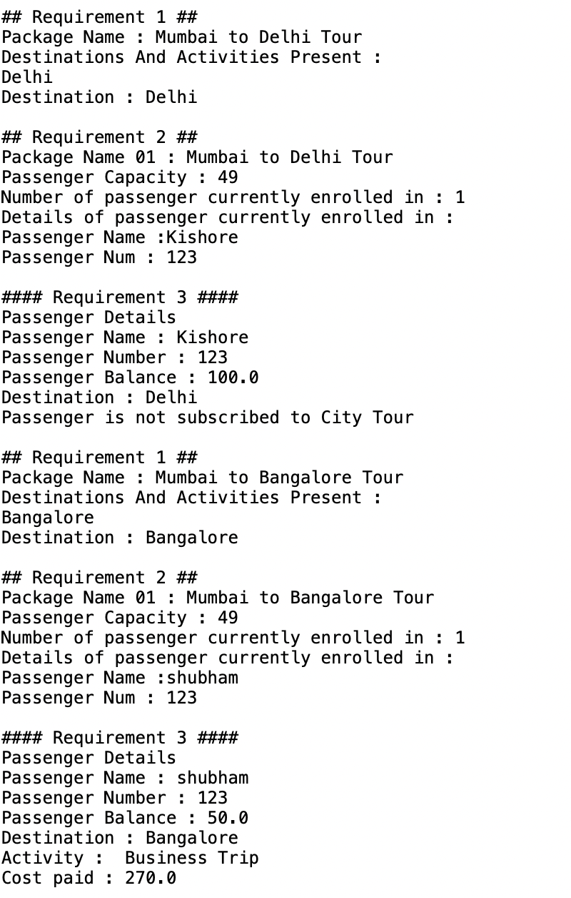
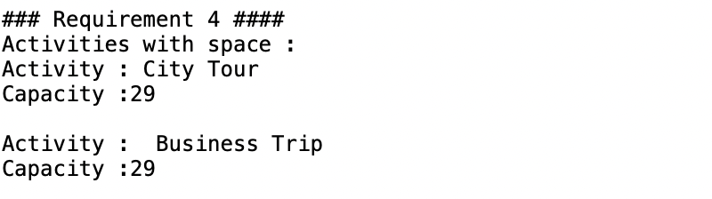
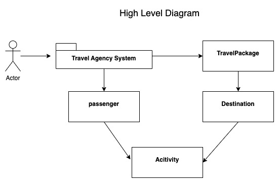
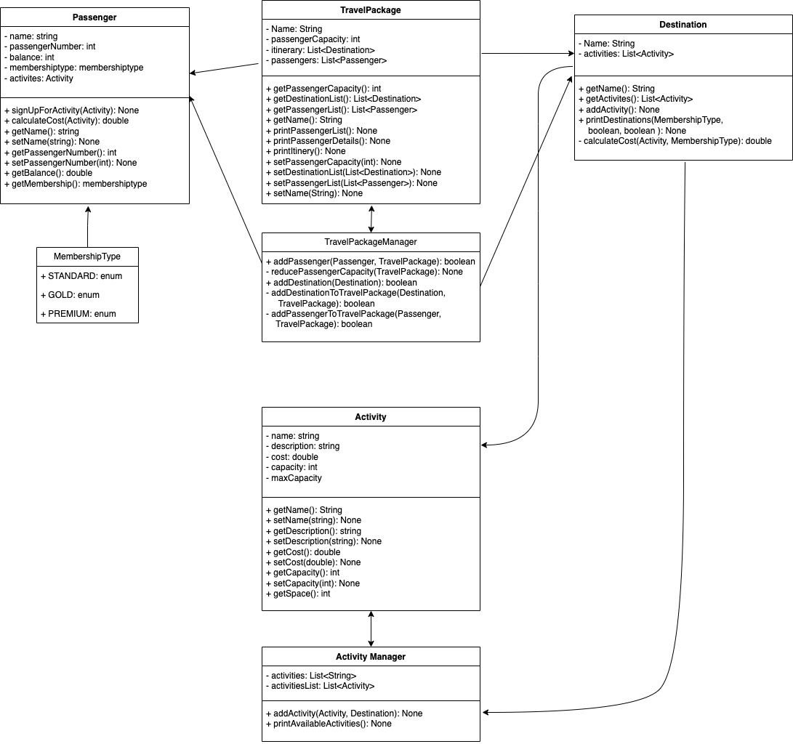

# Travel Package Management System

## Overview
The Travel Package Management System is a Java-based application designed for travel agencies to manage their travel packages, itineraries, and passengers. This system allows for efficient handling of travel-related data, including destinations, activities, passenger details, and financial transactions.

## Features
- Manage travel packages with detailed itineraries.
- Handle destinations and activities within each travel package.
- Manage passenger information, including different passenger types (standard, gold, premium).
- Financial management for activities based on passenger type.
- Reporting functionalities for itineraries, passenger lists, and activity availabilities.

## System Requirements
- Java JDK 11 or higher.
- any java IDE is suggested

## Task requirements

1. Print itinerary of the travel package including: 
    1. travel package name, 
    2. destinations and details of the activities available at each destination, like name, cost, capacity and description.
2. Print the passenger list of the travel package including: 
    1. package name, 
    2. passenger capacity, 
    3. number of passengers currently enrolled and 
    4. name and number of each passenger
3. Print the details of an individual passenger including their 
    1. name, 
    2. passenger number, 
    3. balance (if applicable), 
    4. list of each activity they have signed up for, including the destination the at which the activity is taking place and the price the passenger paid for the activity.
4. Print the details of all the activities that still have spaces available, including how many spaces are available.

## Installation
1. Clone the repository to your local machine.
   ```bash
   git clone https://github.com/kishoreKunisetty/nymble-Task
   ```
2. Navigate to the project directory.
   ```bash
   cd nymble-Task
   ```

## Usage
To run the application:
1. Compile the Java files in your development environment or using a command line tool.
   ```bash
   javac *.java
   ```
2. Execute the main class.
   ```bash
   java Main
   ```

## Project Structure
- `travel_test`: Contains all the source files.
  - `passenger`: Includes classes representing the core entities (`Membership Type`, `Passenger`).
  - `Activity.java`: Contains driving class and manager class for handling business logic (`Activity`, `ActivityManager`).
  - `Destination.java`: Contains driving class  for handling business logic (`Destination`).
  - `TravelPackage.java`: Contains driving class and manager class for handling business logic (`TravelPackage`, `TravelPackageManager`).
  - `Main.java`: The entry point of the application.

- `README.md`: Project description and guidelines.

## Observations 
### Output 1
this output depicts 2 edge cases
- functionality requirement of Each activity is available at one destination only. 
- insufficent balance to buy a activity at a destination


### Output 2
this section display examples of all the required functions 



## High Level Diagram


## Low Level Diagram


## How to Contribute
1. Fork the repository.
2. Create a new branch for your feature (`git checkout -b feature/AmazingFeature`).
3. Commit your changes (`git commit -m 'Add some AmazingFeature'`).
4. Push to the branch (`git push origin feature/AmazingFeature`).
5. Open a pull request.

## License
Distributed under the MIT License. See `LICENSE` for more information.

## Contact
Project Link: [nymble-Task](https://github.com/kishoreKunisetty/nymble-Task)